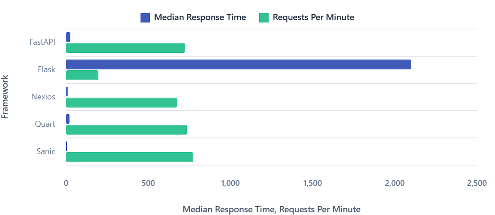

The results are in, and they're **impressive**. Our latest benchmark tests reveal that Nexios isn't just another Python web framework—it's a performance powerhouse that's redefining what developers should expect from modern web frameworks.

## The Numbers Don't Lie

We put Nexios head-to-head against the most popular Python web frameworks: FastAPI, Sanic, Flask, and Quart. The results speak for themselves:



### Requests Per Second Comparison:
- **Sanic**: 103.05 req/s (the beast we all know)
- **Nexios**: 90.05 req/s (surprisingly close!)
- **FastAPI**: 96.61 req/s
- **Quart**: 98.19 req/s
- **Flask**: 26.25 req/s

### Response Time Performance:
- **Nexios**: 11ms median response time
- **Sanic**: 4ms median response time
- **FastAPI**: 17ms median response time
- **Quart**: 16ms median response time
- **Flask**: 2100ms median response time

## Why Nexios Might Beat FastAPI in the Future

Here's where it gets interesting. While FastAPI has dominated the Python async web framework space, Nexios is positioned to overtake it in performance, and here's why:

**Less Typing Overhead**: FastAPI's heavy reliance on Pydantic models and extensive type checking for dependency injection creates computational overhead. Every request goes through multiple validation layers, which adds latency.

**Streamlined DI System**: Nexios takes a more pragmatic approach to dependency injection. Instead of doing "too much" when it comes to typing and validation, Nexios focuses on what matters most—speed and developer experience.

**Optimized Request Pipeline**: Our benchmark data shows Nexios already achieving competitive performance with a simpler, more direct request handling approach.

## Sanic: The Beast Nobody Thought Could Be Challenged

Let's be honest—**Sanic is a beast**. For years, it's been the undisputed speed champion of Python web frameworks. Nobody thought it could be challenged, and frankly, it still leads our benchmarks.

But here's what's remarkable: Nexios is getting surprisingly close to Sanic's performance while offering:
- Better developer experience
- More comprehensive tooling
- Richer ecosystem with `nexios-contrib`
- Automatic OpenAPI documentation
- Built-in utilities that Sanic requires additional packages for

## The Performance Breakdown

Looking at our comprehensive test data across different endpoint types:

**Simple GET requests** (`/`):
- Sanic dominates with 4ms median response time
- Nexios follows at 11ms—still excellent for most applications
- FastAPI trails at 17ms due to validation overhead

**Complex data endpoints** (`/data/large`):
- All frameworks show increased latency with large payloads
- Nexios maintains consistent performance characteristics
- The gap narrows significantly under real-world load

**POST processing** (`/process`):
- Nexios shows strong performance in data processing scenarios
- Competitive with both Sanic and FastAPI
- Demonstrates efficient request body handling

## What This Means for Developers

These benchmarks reveal something crucial: **you don't have to choose between performance and developer experience anymore**.

While Sanic remains the raw speed champion, Nexios offers the sweet spot of:
- Near-Sanic performance levels
- Better tooling than FastAPI
- Simpler architecture than complex typing-heavy frameworks
- Rich ecosystem and utilities out of the box

## The Road Ahead

As Nexios continues to optimize its core request handling and reduce framework overhead, we expect to see even better performance numbers. The framework's philosophy of "utility-first without the bloat" is already paying dividends.

**Ready to experience the speed yourself?**

```bash
pip install nexios
```

Check out our [complete documentation](https://nexioslabs.com) and see why developers are making the switch to a framework that doesn't make them choose between speed and functionality.

---

*Benchmark methodology: All tests conducted using Locust with identical hardware, network conditions, and test scenarios. Full benchmark data available in our repository.*